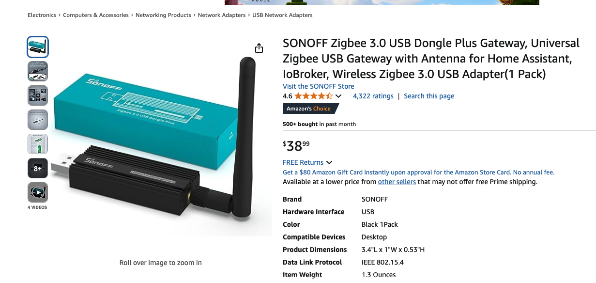

# Requirements/Questions

### Need to avoid Safe Haven Monthly Subscription
### # Safe-haven-repalcement-with-home-automation- remove subscriptions

Got it — you're coming off a 3-year free Safe Haven subscription, and they now want to charge $25/month to continue smart home features like:
* Alaram App integrated with following device
* IQ Panel Control with Home Automation Hub
* SkyBell Front Door Camera with Remote lock/unlock of front door 
* Kwikset Smart Keypad lock for Front Door
*  Lift Master myQ Garage Door 
* Honeywell Thermostats with Dual-zone thermostat control (upstairs + downstairs)

The Alaram app provides following features

* Remote unlock or lock the front door
* View the person through the Front Camera
* Open/Close the Garage Door Remotely
* Control the Home Template Remotely
You want to remove the subscription and still control everything using your home Wi-Fi and still needs above features.

### Requirement is 

* Remove the monthly subscription
* Should be able to view person visited in the front door with motion notification
* Lock and unlock Front door using keypad; Should be able to reset the pin as required
* Open/Close the Garage 
* Temperature control
* Single App to control every thing similar to alaram app

* Thanks for laying that out so clearly! You’re looking to drop the $25/month Safe Haven subscription and still control your smart home devices through Wi-Fi with a single app, keeping all the functionality. Totally doable with some planning. Here's a breakdown of what you'll need, plus a path forward:

---

### 🔧 Devices You Have (and what they use)

| Device | Brand | Protocol | Notes |
|--------|--------|----------|-------|
| IQ Panel | Qolsys | Z-Wave/Zigbee | May be locked by Safe Haven |
| SkyBell | SkyBell | Wi-Fi | May require separate app/cloud |
| Kwikset Smart Lock | Kwikset | Z-Wave or Wi-Fi | Depends on model |
| LiftMaster Garage | myQ | Wi-Fi | Some myQ features require subscription |
| Honeywell Thermostat | Honeywell | Wi-Fi or Z-Wave | Model dependent |

---

### ✅ What You Want (Without Subscription)

1. **Remote access to front door camera + motion alerts**
2. **Lock/unlock door remotely + keypad PIN management**
3. **Garage door control remotely**
4. **Temperature control for dual-zone**
5. **One app to control everything**

---

### 🛠️ Recommendation Path: Use **Home Assistant**

**Home Assistant** is a powerful free platform that can do all of this, with no monthly fees. Here’s how it fits your setup:

#### Why Home Assistant?
- Free, open-source, local control (no cloud dependency)
- Works with Z-Wave, Zigbee, Wi-Fi devices
- Integrates with SkyBell, Kwikset, myQ, Honeywell, etc.
- Has mobile app similar to Alarm app (can lock, unlock, see video, etc.)

---

### 🧱 Step-by-Step Plan

#### 1. **Set up Home Assistant**
- Get a small device like a Raspberry Pi 4, or use a mini-PC
- Install [Home Assistant OS](https://www.home-assistant.io/installation/raspberrypi)
- Connect it to your home network

#### 2. **Integrate Devices**

| Device | Home Assistant Integration |
|--------|-----------------------------|
| **IQ Panel** | Likely replace with Z-Wave USB stick (IQ Panel may be locked to Safe Haven) |
| **SkyBell** | Limited integration – consider replacing with Ring/Doorbird if needed |
| **Kwikset Lock** | Works via Z-Wave or Wi-Fi depending on model |
| **myQ Garage** | Home Assistant supports myQ (requires login, but no subscription) |
| **Honeywell Thermostat** | Supported if it’s Wi-Fi or Z-Wave model |

> If your Kwikset and thermostats are Z-Wave: Use a **Z-Wave USB dongle** (like Aeotec Z-Stick) with Home Assistant.

---

### 📱 App Features (Home Assistant)

- View camera feed (with compatible cams)
- Lock/unlock doors + PIN control
- Control garage and thermostat
- Set automations (e.g., motion triggers notifications)
- Works inside and outside home (via secure remote access)

---

### 📦 Optional Device Replacements (if current gear is locked or limited)

| Current | Replacement |
|--------|-------------|
| IQ Panel | Z-Wave stick + Home Assistant |
| SkyBell (limited control) | Reolink Doorbell / DoorBird / Ring with Home Assistant |
| Kwikset (if Z-Wave) | Works! |
| myQ | Works (some people use [myQ workaround](https://github.com/homebridge/homebridge-myq)) |
| Honeywell Thermostat | Works if Wi-Fi or Z-Wave |

---

### 🧠 Summary

You can ditch the $25/month subscription **and keep full control** of your smart home. Here's the big picture:

- ✅ Control everything via **Home Assistant App**
- ✅ Keep all automation (door, camera, thermostat, garage)
- ✅ Local control = no monthly fee
- ⚠️ May need to replace or reset some devices if they’re locked to Safe Haven

---

Want help identifying which devices you have exactly (e.g., lock/thermostat model numbers) so I can tailor it tighter? Or I can help you with shopping list and setup instructions too.

## Requirements: Give me the Option with Hubitat and SmartThings

Absolutely — let’s break it down using **Hubitat** and **SmartThings** as your alternatives to the Alarm App + Safe Haven subscription. Both can get you very close to your desired setup, with **no monthly fees** and **single-app control**.

---

## ✅ Your Requirements Recap

- No subscription
- Remote door lock/unlock + PIN reset
- Doorbell camera view + motion alerts
- Garage control
- Dual-zone thermostat control
- Unified app control (like Alarm App)

---

# 🟢 OPTION 1: **Hubitat Elevation**

### 🌟 Pros:
- 100% local control (no internet needed for automations)
- No subscription ever
- Strong Z-Wave/Zigbee support (great for locks and thermostats)
- App available for remote access
- Can integrate with some IP cameras

### 🔌 Device Compatibility:
| Device | Hubitat Integration |
|--------|---------------------|
| **Kwikset Lock (Z-Wave)** | ✅ Full support, PIN reset too |
| **SkyBell Doorbell** | ⚠️ Limited — no native support. May need replacement (Reolink, Unifi, Ring with workaround) |
| **myQ Garage Door** | ✅ Works via community integration |
| **Honeywell Thermostats** | ✅ Z-Wave versions work great; Wi-Fi via cloud integration |
| **IQ Panel** | ❌ Likely not compatible — replace with Z-Wave hub like Hubitat itself |

### 📱 App Control:
- Hubitat app for remote access
- Dashboard you can customize (lock, camera, garage, temp)
- Notifications via app or text

### 🧠 Automation:
- Powerful rule engine (“Rule Machine”)
- Example: “If motion at front door + after sunset → Notify + turn on porch light”

### 📦 Suggested Add-ons:
- **Z-Wave stick or sensors** (if needed)
- **Replacement Doorbell** (e.g., Reolink, Eufy, Ring with cloud integration)

---

# 🟡 OPTION 2: **Samsung SmartThings (new Aeotec version)**

### 🌟 Pros:
- Easier to set up than Hubitat
- Good ecosystem and mobile app
- Cloud + local hybrid
- Good camera integration via SmartThings-compatible brands

### 🔌 Device Compatibility:
| Device | SmartThings Integration |
|--------|--------------------------|
| **Kwikset Lock** | ✅ Full support, remote + PIN management |
| **SkyBell** | ⚠️ Not natively supported — suggest replacing with Ring or compatible video doorbell |
| **myQ Garage** | ✅ Works with Chamberlain integration |
| **Honeywell Thermostat** | ✅ Wi-Fi models integrate via cloud |
| **IQ Panel** | ❌ Not compatible — use SmartThings as your new “hub” |

### 📱 App Control:
- SmartThings app (great UI)
- One place for everything: locks, thermostats, garage, motion alerts
- Can use voice assistants like Alexa/Google

### 🧠 Automation:
- Automations and scenes (easy setup)
- Example: “Unlock front door + turn on downstairs lights when you arrive home”

---

## 🔚 Summary: Hubitat vs. SmartThings

| Feature | **Hubitat** | **SmartThings** |
|--------|--------------|-----------------|
| Monthly Cost | Free | Free |
| Local Control | ✅ Full local | ⚠️ Partial (some cloud-based) |
| Ease of Use | ⚠️ Advanced users | ✅ Beginner-friendly |
| Z-Wave/Zigbee Support | ✅ Excellent | ✅ Good |
| Camera Support | ⚠️ Limited | ✅ Better with compatible brands |
| Automation Power | ✅ Super flexible | ✅ Good, simpler |
| App Experience | Simple, customizable | Polished, intuitive |
| Future-proofing | DIY focused | Cloud-dependent |

---

## 🧰 What You’ll Likely Need:
- **Hubitat Elevation C-8** (or SmartThings/Aeotec Hub)
- Confirm **Kwikset is Z-Wave or Zigbee** (or Wi-Fi)
- Possibly replace **SkyBell** with:
  - **Ring**, **Reolink**, or **Eufy** (for video + motion)
- myQ works on both platforms
- Honeywell Thermostat usually supported

---

Want help choosing between them based on your comfort level? Or I can walk you through the ideal shopping list and setup steps for either path.

### Requirements

Compare all the 3 options viz., Hubitat, SmartThings, Home Assistance
Perfect — let's build out your **shopping list and setup plan**, tailored to your smart home gear and the hub platform you choose.

I'll give you **three versions** of the shopping/setup list:  
- 🔧 **Home Assistant (powerful, DIY-friendly)**  
- ⚙️ **Hubitat Elevation (local, stable, mid-level effort)**  
- 📱 **SmartThings (easiest setup)**

---

## 🔧 HOME ASSISTANT SHOPPING & SETUP

### 🛒 **Shopping List**
| Item | Details |
|------|---------|
| 🧠 Raspberry Pi 4 (4GB+) or Intel NUC | ~$80–$200 depending on hardware |
| 🧲 Z-Wave/Zigbee USB Stick | [Zooz S2 Stick](https://www.thesmartesthouse.com/products/zooz-z-wave-plus-s2-stick-zst10-700-series) or Aeotec Z-Stick 7 (~$40) |
| ☁️ (Optional) Nabu Casa for remote access | $6.50/month (optional) |
| 🔔 Optional: Replace SkyBell with Reolink, Ring, or UniFi doorbell | $60–$150 |

### 🧰 Setup Steps
1. **Install Home Assistant OS** (on Pi/NUC or VirtualBox)
2. **Plug in Z-Wave USB stick** for Kwikset + Thermostats
3. **Install Integrations** for:
   - `myQ` for garage
   - `Honeywell` or Z-Wave for thermostat
   - IP Camera (Reolink, UniFi, etc.)
4. **Create Dashboards** with door lock, garage, temp, camera
5. **Add Automations** (e.g., lock door at night, alert on motion)

---

## ⚙️ HUBITAT ELEVATION SETUP

### 🛒 **Shopping List**
| Item | Details |
|------|---------|
| 🧠 Hubitat Elevation C-8 Hub | ~$150 |
| 🔔 Replace SkyBell (if needed) | Reolink, Eufy, UniFi |
| 📱 Optional Dashboard Tablet | Fire HD 8 or old tablet (~$70) |

### 🧰 Setup Steps
1. **Plug in Hubitat Hub**
2. **Pair Devices via Z-Wave/Zigbee**:
   - Kwikset Lock
   - Honeywell Thermostats
3. **Install Community Drivers**:
   - `myQ Garage Door` integration
4. **Use Built-in Dashboard Creator**:
   - Add Lock, Camera Feed (if supported), Garage, Thermostat
5. **Set up Automations** in Rule Machine

⚠️ **Camera Support Tip**: Hubitat does not support live SkyBell feeds — suggest replacing with something like:
- **Reolink Doorbell** (works with ONVIF)
- **Eufy with RTSP**
- **UniFi Protect** (if using UniFi ecosystem)

---

## 📱 SMARTTHINGS SETUP

### 🛒 **Shopping List**
| Item | Details |
|------|---------|
| 🧠 Aeotec SmartThings Hub | ~$130 |
| 📷 Replace SkyBell with Ring Doorbell (native support) | ~$100 |
| 📱 Use SmartThings App (Free) | - |

### 🧰 Setup Steps
1. **Set up SmartThings Hub**
2. **Pair Devices**:
   - Kwikset Lock (Z-Wave or Wi-Fi)
   - Thermostat (Wi-Fi or Z-Wave)
   - myQ Garage (via Chamberlain integration)
   - Ring Doorbell (for video + notifications)
3. **Use SmartThings App** to:
   - Control all devices
   - Get motion alerts
   - Lock/unlock door remotely
4. **Set Automations** (e.g., unlock + disarm system, adjust temp)

---

## ⚖️ Final Pick Based on Comfort Level

| Your Comfort With Tech | Suggested Platform |
|------------------------|--------------------|
| 🧠 Comfortable with setup + DIY | Home Assistant |
| ⚙️ Moderate, want local + reliable | Hubitat |
| 📱 Prefer plug & play + clean app | SmartThings |

---

Want me to tailor a list **based on your exact devices (lock model, thermostat model, etc.)**? If you drop model numbers or pics, I can make sure everything works out of the box.

Great idea — let’s **compare Home Assistant, Hubitat, and SmartThings** head-to-head so you can pick the best fit for your smart home setup **without a subscription**.

Here’s a detailed comparison, focused specifically on your needs: unified app control, door lock, camera, garage, thermostat, no monthly fees, and automation.

---

## 📊 Smart Home Hub Comparison

| Feature | **Home Assistant** | **Hubitat Elevation** | **SmartThings (Aeotec)** |
|--------|---------------------|------------------------|--------------------------|
| **Cost** | Free (Open-source)   ~$80–$150 (hardware) | ~$150 | ~$130 |
| **Monthly Fees** | ❌ None | ❌ None | ❌ None |
| **App Quality** | Good, customizable   (can feel technical) | Simple, functional | Excellent UX |
| **Remote Access** | ✅ Free via Nabu Casa ($6/mo optional, not required) | ✅ Free via app | ✅ Free via app |
| **Local Control** | ✅ Full (Privacy + Speed) | ✅ Full | ⚠️ Partial (cloud-dependent) |
| **Z-Wave/Zigbee Support** | ✅ Excellent (via USB stick) | ✅ Built-in | ✅ Built-in |
| **Wi-Fi Device Support** | ✅ Strong | ⚠️ Limited | ✅ Strong |
| **Camera Integration** | ✅ Broad (e.g. Reolink, Unifi, etc.) | ⚠️ Limited | ✅ Works with Ring, Nest, etc. |
| **Kwikset Smart Lock** | ✅ Full support (PIN, remote) | ✅ Full support | ✅ Full support |
| **SkyBell Doorbell** | ⚠️ Limited (no local API) | ⚠️ Not supported | ⚠️ Not supported |
| **Garage (myQ)** | ✅ Works via integration | ✅ Works via community driver | ✅ Native support |
| **Honeywell Thermostat** | ✅ Works (Z-Wave & Wi-Fi) | ✅ Z-Wave models only | ✅ Works (Wi-Fi & Z-Wave) |
| **Unified Dashboard** | ✅ Fully customizable | ✅ Basic dashboards | ✅ Built-in app dashboard |
| **Automation** | ✅ Extremely flexible  (Node-RED, YAML, GUI) | ✅ Advanced (Rule Machine) | ✅ Easy (Scenes, Routines) |
| **Learning Curve** | ⚠️ Steep | ⚠️ Moderate | ✅ Easy |
| **Voice Assistants** | Alexa, Google, Siri | Alexa, Google | Alexa, Google |

---

## ✅ Based on Your Priorities:

| Goal | Best Option |
|------|-------------|
| **Avoid subscription & retain full control** | **Home Assistant** or **Hubitat** |
| **Simple setup, clean mobile app** | **SmartThings** |
| **Camera + Motion Notifications** | **Home Assistant** (best flexibility) |
| **PIN management for Kwikset lock** | All 3 (if lock is Z-Wave/Wi-Fi) |
| **Garage control (myQ)** | All 3 support it |
| **Dual-zone thermostat (Honeywell)** | All 3 (if model is compatible) |
| **Best for tech-savvy/power user** | **Home Assistant** |
| **Best out-of-box, minimal tinkering** | **SmartThings** |
| **Best privacy + no cloud dependence** | **Hubitat** or **Home Assistant** |

---

## 🧠 TL;DR Recommendation

| If You Want... | Go With |
|----------------|---------|
| 🔧 Ultimate control & no cloud | **Home Assistant** |
| 🧩 Balance of power + ease | **Hubitat Elevation** |
| 📱 Polished app & easy setup | **SmartThings** |

---

Want me to give you a **shopping/setup list** based on which one you lean toward? Or help confirm which devices (e.g., lock/thermostat model numbers) will definitely work before you buy?

Great idea — let’s **compare Home Assistant, Hubitat, and SmartThings** head-to-head so you can pick the best fit for your smart home setup **without a subscription**.

Here’s a detailed comparison, focused specifically on your needs: unified app control, door lock, camera, garage, thermostat, no monthly fees, and automation.

## Devices and Links
- DeviceList
  - [SmartThings Hub 3rd Generation [GP-U999SJVLGDA]](https://www.amazon.com/Samsung-SmartThings-Generation-GP-U999SJVLGDA-Automation/dp/B07FJGGWJL/ref=sr_1_8?c=ts&dib=eyJ2IjoiMSJ9.yUYCFKwRl9WppKWWkvZz2aczADmEp_xHYNfyjcrM7I8aTnwxVqzSpoOADRI5X5Wn-l6hfdVXXtcw1KYt0T_TpW14NHdZbzDpBQ8y6-hM7crCC5D1uC_6VPeeIypl1tjtVFfw_AiDqKIHO_wYEiFS-84gCnOHrJK4B1ysTvPp_N4DHRH8XjnDG4Qdri0VgRImQdrhNiPwOXTfV09Jbv8FYKRK7Vna3D_ZnJANyouujp6tafBOdzSxN6wvt8OiR_xPvUxOfnJU820-82o7xPt1X1Y7-ghClv1LdA1GHOn9q6o.LXO3Di05x0eEs7lOrRTzHUz_zPvsoiy0Hp4TqB-mqJI&dib_tag=se&keywords=Home+Automation+Hubs+%26+Controllers&qid=1743978756&s=lamps-light&sr=1-8&ts_id=6478740011)
  - Hubitat
    - 
    - [Hubitat Elevation Home Automation Hub](https://www.amazon.com/Hubitat-Elevation-Automation-Pro-Compatible/dp/B0CR4G1G8M?ref_=ast_sto_dp)
  - [home-assistant](https://www.home-assistant.io/)
    - [Home Assistant](https://www.amazon.com/dp/B0CXVKSG19?maas=maas_adg_BB51722E249D328CABB2F6DF1F8976CC_afap_abs&ref_=aa_maas&tag=maas )
  - [SONOFF SNZB-01P Zigbee Wireless Switch - Home Assistant Compatible](https://www.seeedstudio.com/SONOFF-SNZB-01P-Zigbee-Wireless-Switch-p-6363.html)

  - [SONOFF Zigbee 3.0 USB Dongle Plus Gateway, Universal Zigbee USB Gateway with Antenna for Home Assistant, IoBroker, Wireless Zigbee 3.0 USB Adapter](https://www.amazon.com/SONOFF-Gateway-Universal-Assistant-Wireless/dp/B09KXTCMSC/ref=pd_lpo_d_sccl_1/144-8908335-8260966?pd_rd_w=Kix8I&content-id=amzn1.sym.4c8c52db-06f8-4e42-8e56-912796f2ea6c&pf_rd_p=4c8c52db-06f8-4e42-8e56-912796f2ea6c&pf_rd_r=9J3FKCY2Q0KVDVX4Y906&pd_rd_wg=DTVzO&pd_rd_r=aeccf966-f700-4870-8e94-c4281055e6ee&pd_rd_i=B09KXTCMSC&psc=1)
    - 
    

Certainly! Here are the links to the smart home hubs I mentioned earlier:

1. [**Aeotec Smart Home Hub**](https://aeotec.com/products/aeotec-smartthings-hub/): This hub serves as a central control unit, connecting Z-Wave, Zigbee, or Wi-Fi devices that are Works with SmartThings certified. citeturn0search15

3. **Hubitat Elevation**: A local, reliable, fast, and private home automation hub that connects your smart home devices. citeturn0search2
 ** Very good Option.
 It has 3 Models
 - Best Model 
 - [Hubitat Elevation® Model C-8 Pro](https://hubitat.com/products/7194323058731): 169$ 
 - [Hubitat Elevation Home Automation Hub](https://www.amazon.com/Hubitat-Elevation-Automation-C-8-Compatible/dp/B0BSNZVDJ2/ref=sr_1_8?c=ts&dib=eyJ2IjoiMSJ9.fR27Gnh-oL9MOmExcRdy1VZJXHtIq5AZqcN3x-mgkF4Qn33hLT4EMCbjvzVdm9uNa-wdOa2s-Je08c2slHCB6E9Z2uWB6iN8GUMDlMs1BpZUioFIHRcLbERnxUNc9I2tfUFTa1tdBWbRljucCLa6q826ZWLvVO4FZWZ4sQwAeOFd67BOWVZU-DRc5b3HUMRzQdrhNiPwOXTfV09Jbv8FYDHucq6fBnZP7V3L5rJaLqIcysytvLHPrfxvFdpHKAuJl94Bxbwp7Y823hksEKavDLhzGTSSLjtv498ahfpiEp0.F_YoVFFfGJC7kqiGHdpBsOfoKD1KfwFJlEGFyO5yG6E&dib_tag=se&keywords=Home+Automation+Hubs+%26+Controllers&qid=1744001203&s=lamps-light&sr=1-8&ts_id=6478740011): 150$
 
 - [Hubitat Elevation Home Automation Hub (Model C-7) Compatible with Alexa, HomeKit, Google Home, Zigbee, Z-Wave, Lutron](https://www.amazon.com/Hubitat-Elevation-Home-Automation-Hub/dp/B07D19VVTX/ref=sr_1_7?c=ts&dib=eyJ2IjoiMSJ9.fR27Gnh-oL9MOmExcRdy1VZJXHtIq5AZqcN3x-mgkF4Qn33hLT4EMCbjvzVdm9uNa-wdOa2s-Je08c2slHCB6E9Z2uWB6iN8GUMDlMs1BpZUioFIHRcLbERnxUNc9I2tfUFTa1tdBWbRljucCLa6q826ZWLvVO4FZWZ4sQwAeOFd67BOWVZU-DRc5b3HUMRzQdrhNiPwOXTfV09Jbv8FYDHucq6fBnZP7V3L5rJaLqIcysytvLHPrfxvFdpHKAuJl94Bxbwp7Y823hksEKavDLhzGTSSLjtv498ahfpiEp0.F_YoVFFfGJC7kqiGHdpBsOfoKD1KfwFJlEGFyO5yG6E&dib_tag=se&keywords=Home+Automation+Hubs+%26+Controllers&qid=1744001203&s=lamps-light&sr=1-7&ts_id=6478740011): 100$ Note: Try to avoid this model since, it has limited protocal support

- [Aqara Smart Hub M3 for Home Automation, Matter Controller, Thread Border Router, Features Zigbee, Bluetooth, Wi-Fi, PoE, IR, Supports Alexa, Apple HomeKit, SmartThings, IFTTT](https://www.amazon.com/Aqara-Automation-Controller-Bluetooth-SmartThings/dp/B0CWLHSKYC/ref=sr_1_3_sspa?c=ts&dib=eyJ2IjoiMSJ9.nXlOJ8mov-FML19V1ZPznl2_R_pcy5tUh-lVWtUjww4H3CQ_PYfIO34qFqXqMTorUaYtTApFbvMyQbUuWGmdnz7I7F1xbg1EVmXqjJ-WFsDJ8LeAPUp1MmRkd5Oh6ZNe0nK5LRVqvRgtYrFDBNO43keOh4dmcb37QNejZ4uSN_svfu6cOY6FGcbnU9AwVg7mQdrhNiPwOXTfV09Jbv8FYKRK7Vna3D_ZnJANyouujp5pQx-G937P077a2LI-_vq1HBm4qUgYBZzAeKFFXNTGKPLUV-vEe9ywCqdqObPY3_w.wrBemzWtGR8IGDQ4Js_6X0hzzhapKLSJW8aIbOocZUI&dib_tag=se&keywords=Home+Automation+Hubs+%26+Controllers&qid=1744001397&s=lamps-light&sr=1-3-spons&ts_id=6478740011&sp_csd=d2lkZ2V0TmFtZT1zcF9hdGY&psc=1) : 109$ Best Value

If one time cost is not an issue go for the pro model which is 200$ which has max support.